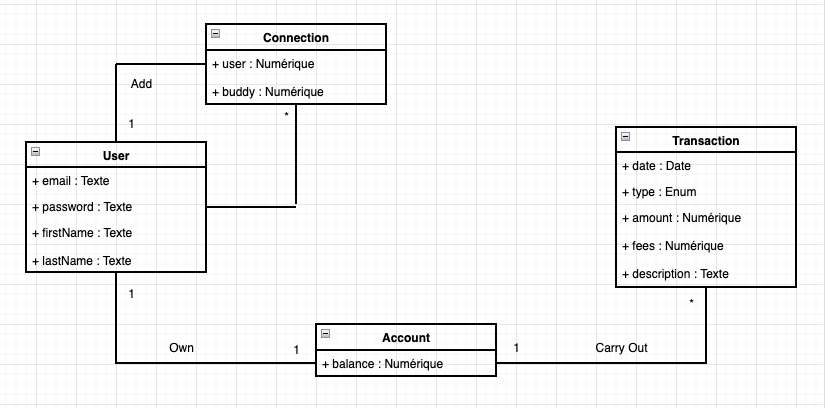
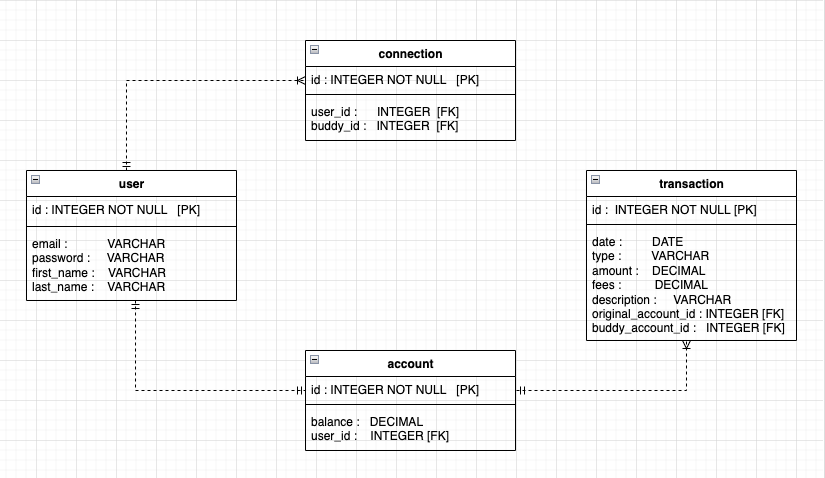

# Pay My Buddy

Pay My Buddy is an application that allows its users to send and receive money using their mobile

## Getting Started

These instructions will get you a copy of the project up and running on your local machine for development and testing purposes. See deployment for notes on how to deploy the project on a live system.

## Prerequisites

What things you need to install the software and how to install them

- Java 1.8
- Maven 4.0.0
- Spring Boot 2.6.2
- MySQL 8.0.17
- Log4j

## Installing

A step by step series of examples that tell you how to get a development env running:

1.Install Java:

https://docs.oracle.com/javase/8/docs/technotes/guides/install/install_overview.html

2.Install Maven:

https://maven.apache.org/install.html

3.Install MySQL:

https://dev.mysql.com/downloads/mysql/

After downloading the mysql 8 installer and installing it, you will be asked to configure the password for the default `root` account.
This code uses the default root account to connect and the password can be set as `Rootroot`. If you add another user/credentials make sure to change the same in the code base.

### Running App

Post installation of MySQL you will have to set up the tables and data in the database.
For this, please run the sql commands present in the `schema.sql` (in first) and `data.sql` files under the `resources` folder in the code base :

SOURCE [path to file]

Finally, you will be ready to import the code into an IDE of your choice and run the App.java to launch the application.

## UML class diagram

## MPD

### Testing

The app has unit tests and integration tests written.

To run the tests from maven, go to the folder that contains the pom.xml file and execute the below command.

`mvn test`
